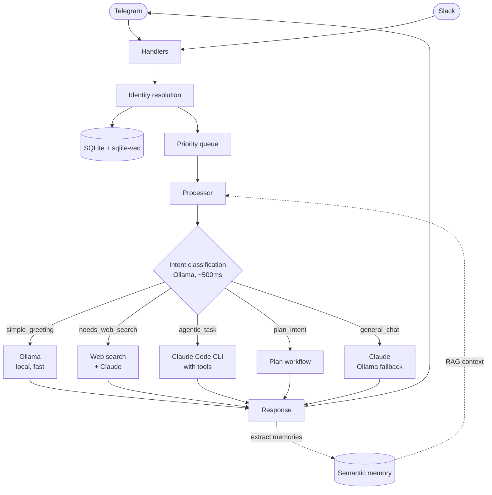

# Jarvis

[](https://github.com/frhd/jarvis/actions/workflows/ci.yml)
[](LICENSE)
[](package.json)
[](tsconfig.json)

A personal AI assistant that lives in your Telegram. It remembers what you tell it, answers with the right model for the job — a local Ollama model for quick replies, Claude for the hard stuff — transcribes your voice messages, searches the web, and can even run agentic coding tasks on your machine through the Claude Code CLI.

I built Jarvis because I wanted an assistant that's actually *mine*: it runs on my hardware, stores everything in a local SQLite database, and every capability is an opt-in feature flag. It started as a message-ingestion service and grew into a small platform — semantic memory, multi-model routing, proactive scheduling, and a reliability layer with circuit breakers and a dead-letter queue.

<!-- TODO: add demo GIF here — a voice message getting transcribed and answered, or an agentic task running -->

## Highlights

- **Semantic memory + RAG** — extracts facts from conversations, embeds them with sqlite-vec, and retrieves relevant context for every response
- **Multi-model LLM routing** — intent classification picks the cheapest model that can do the job: local Ollama for greetings, Claude for reasoning, with provider abstractions for OpenAI, Gemini, and LM Studio
- **Agentic tasks** — file operations and shell commands via Claude Code CLI with tool access (owner-only, gated by `OWNER_TELEGRAM_ID`)
- **Voice transcription** — faster-whisper microservice turns voice notes into text before processing
- **Web search** — current-events questions get search results injected before the LLM call
- **Multi-platform identity** — a unified user/conversation model spans Telegram and Slack, so memory follows the person, not the platform
- **Proactive messaging** — cron-scheduled check-ins with timezone and quiet-hours support
- **Apple Calendar integration** — natural-language event creation via CalDAV with a propose-then-confirm flow
- **Reliability layer** — priority queue with age-based escalation, exponential-backoff retries, circuit breakers, dead-letter queue, health checks, and self-healing failover (Claude → Ollama)
- **LLM-as-judge regression suite** — 20 scenario tests validate response quality with a local judge model

## Architecture



The codebase follows a layered architecture — handlers receive platform events, services own business logic, repositories wrap Drizzle ORM, and background workers handle retries, escalation, and cleanup. Services are wired through a two-tier factory pattern (factories create singletons, lazy getters resolve them) to keep the dependency graph acyclic — enforced in CI with `madge`.

## Everything is opt-in

Each capability sits behind a feature flag, validated at startup with Zod:

| Flag | Capability | Default |
|------|-----------|---------|
| `MEMORY_ENABLED` / `RAG_ENABLED` | Semantic memory and retrieval-augmented context | on |
| `CACHE_ENABLED` | Semantic response cache | on |
| `WHISPER_ENABLED` | Voice transcription microservice | on |
| `SEARCH_ENABLED` | Web search enrichment | on |
| `CLAUDE_ENABLED` | Claude responses and agentic mode | on |
| `METRICS_ENABLED` / `ALERTING_ENABLED` | Monitoring and alerts | on |
| `BROWSER_ENABLED` | Playwright page-content extraction | off |
| `BROWSER_MCP_ENABLED` | Browser tools for agentic mode | off |
| `PROACTIVE_ENABLED` | Scheduled proactive messages | off |
| `CALENDAR_ENABLED` | Apple Calendar (CalDAV) | off |
| `THERAPIST_ENABLED` | Empathetic-listening mode | off |
| `CEO_ENABLED` | Slack bot module | off |
| `AUTH_ENABLED` | API authentication (JWT / API key) | off |

See [`.env.example`](.env.example) and [docs/CONFIGURATION.md](docs/CONFIGURATION.md) for the full reference.

## Quick start

### Prerequisites

- Node.js 18+
- [Ollama](https://ollama.com) running locally (for intent classification and fast replies)
- [Claude Code CLI](https://claude.com/claude-code) (optional, for Claude responses and agentic tasks)
- Python 3.10+ (optional, for voice transcription)

### Install and configure

```bash
npm install
cp .env.example .env
```

Get your Telegram API credentials from https://my.telegram.org/apps and set them in `.env`:

```ini
API_ID=your_api_id
API_HASH=your_api_hash
PHONE_NUMBER=+1234567890
SESSION_STRING=          # saved automatically after first login

LLM_ENABLED=true
LLM_BASE_URL=http://localhost:11434
LLM_MODEL=mistral-small:24b-instruct-2501-q4_K_M

CLAUDE_ENABLED=true
CLAUDE_CLI_PATH=claude
CLAUDE_MODEL=sonnet
```

### Run

```bash
npm run db:migrate   # create the SQLite database
npm run dev          # development mode with hot reload
```

For production, `npm run prod:pm2` builds and starts everything under PM2. Docker (`npm run prod:docker:up`) and macOS launchd deployments are also supported — see [docs/DEPLOYMENT.md](docs/DEPLOYMENT.md).

### Voice transcription (optional)

```bash
cd services/whisper
python -m venv .venv && source .venv/bin/activate
pip install -e .
pm2 start ecosystem.config.cjs --only whisper
```

## Common commands

| Script | Description |
|--------|-------------|
| `npm run dev` | Development mode with hot reload |
| `npm run build` | Compile TypeScript, fix ESM imports, copy migrations |
| `npx vitest run` | Run the test suite (~2,400 tests) |
| `npm run regression` | LLM-as-judge quality regression (requires Ollama) |
| `npm run db:migrate` | Run database migrations |
| `npm run db:studio` | Open Drizzle Studio (DB inspector) |
| `npm run check:circular` | Verify no circular dependencies |
| `npm run prod:pm2` | Build and start with PM2 |
| `npm run logs` | Tail the application log |

## Project structure

```
src/
├── api/            # HTTP API gateway and routes
├── clients/        # External service wrappers (LLM, Claude, embeddings, CalDAV)
├── config/         # Env schema (Zod), feature flags, runtime config
├── db/             # Drizzle schema, migrations, backfills
├── errors/         # Error codes and typed error classes
├── handlers/       # Telegram event handlers
├── interfaces/     # Service/repository interfaces for dependency inversion
├── llm/            # Multi-model abstraction: registry, router, providers
├── modules/        # Pluggable modules (e.g. Slack CEO bot)
├── platforms/      # Platform integrations (Slack)
├── repositories/   # Data access layer (Drizzle ORM)
├── services/       # Business logic: memory, routing, intent, reliability, …
├── utils/          # Logging, shutdown registry, error classification
└── workers/        # Background workers: retry, escalation, DLQ, cleanup

services/whisper/   # Python faster-whisper transcription microservice
data/               # SQLite database (WAL + sqlite-vec) and downloaded media
```

## Testing

```bash
npx vitest run        # unit tests, colocated with source
npm run regression    # 20 LLM-judged quality scenarios against a live Ollama
```

Integration tests that need live services (Ollama, Whisper, Claude CLI) are excluded from the default run and executed standalone with `npx tsx`.

## Documentation

- [CONFIGURATION.md](docs/CONFIGURATION.md) — full environment-variable reference
- [DEPLOYMENT.md](docs/DEPLOYMENT.md) — PM2, Docker, and launchd deployment
- [API.md](docs/API.md) — HTTP API reference
- [TROUBLESHOOTING.md](docs/TROUBLESHOOTING.md) — common issues and fixes
- [SECURITY_CONFIG.md](docs/SECURITY_CONFIG.md) — auth and hardening
- [platform-memory-architecture.md](docs/platform-memory-architecture.md) — how cross-platform memory works
- [dead-letter-queue.md](docs/dead-letter-queue.md) — failure handling internals
- [examples/](examples/) — standalone usage examples for services and config
- [CONTRIBUTING.md](CONTRIBUTING.md) — code style and contribution guidelines

From the blog: [Debugging Claude Code CLI integration — a journey through silent timeouts](blog/2025-12-22-debugging-claude-cli-silent-timeouts.md)

## License

[MIT](LICENSE)
